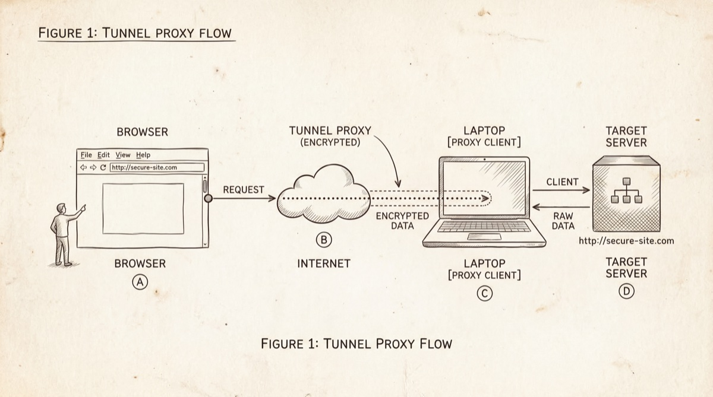
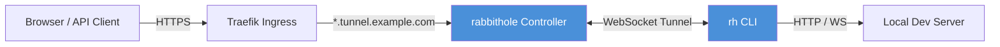
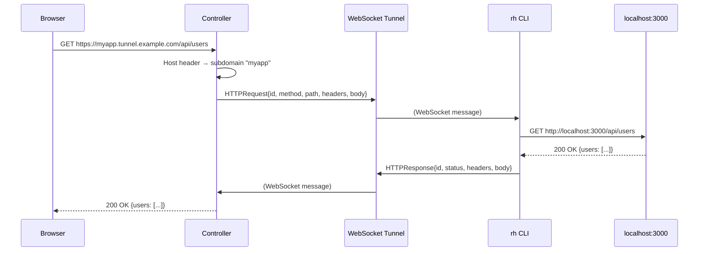
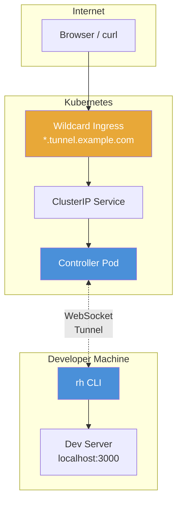

# rabbithole

<p align="center">
  
</p>

Open-source dev proxy — an alternative to ngrok. Expose your local development server to the internet through a secure WebSocket tunnel.

## How it works

<p align="center">
  
</p>

rabbithole consists of two components: a **controller server** running in Kubernetes and a **CLI (`rh`)** running on the developer's machine.



A single wildcard DNS record (`*.tunnel.example.com`) points to the controller. When a request arrives, the controller inspects the `Host` header to determine which tunnel to route it through — no per-session Kubernetes Ingress resources needed.

### Request flow



### WebSocket passthrough

Rabbithole supports WebSocket passthrough out of the box. If your local app uses WebSocket connections, they work transparently through the tunnel — each stream is multiplexed over the single tunnel WebSocket using unique stream IDs.

## Quick start

### Install the CLI

```bash
# From source
git clone https://github.com/mxcd/rabbithole.git
cd rabbithole
just install
```

Or download a pre-built binary from [Releases](https://github.com/mxcd/rabbithole/releases).

### Configure

```bash
rh config set server https://tunnel.example.com
rh config set apikey YOUR_API_KEY
```

### Start a tunnel

```bash
# Expose localhost:3000 with a random subdomain
rh tunnel 3000

# Expose with a custom subdomain
rh tunnel 3000 --name myapp
```

Output:

```
Rabbithole tunnel active
  https://myapp.tunnel.example.com → http://localhost:3000

Press Ctrl+C to close the tunnel.

GET    /api/users           200  12ms
POST   /api/users           201  45ms
WS     /ws                       [open]
```

## Deploy the controller

### Prerequisites

- Kubernetes cluster with an ingress controller (e.g. Traefik)
- Wildcard DNS record (`*.tunnel.example.com`) pointing to the cluster
- cert-manager for wildcard TLS certificates (DNS-01 challenge)

### Helm

```bash
helm install rabbithole ./deploy/helm \
  --set baseDomain=tunnel.example.com \
  --set apiKeys="rh_abc123:alice,rh_def456:bob" \
  --set image.tag=v0.1.0
```

### Docker

```bash
docker run -d \
  -p 8080:8080 \
  -e BASE_DOMAIN=tunnel.example.com \
  -e API_KEYS="rh_key:myuser" \
  -e SESSION_SECRET_KEY="<64-char-key>" \
  -e SESSION_ENCRYPTION_KEY="<32-char-key>" \
  -e DEFAULT_ADMIN_PASSWORD="<password>" \
  ghcr.io/mxcd/rabbithole:latest
```

## Dashboard

The controller serves a web dashboard on the base domain (`tunnel.example.com`) showing active tunnels, request counts, and live connection status. The dashboard is protected by a password login.

```
┌──────────────────────────────────────────────────────────┐
│  Rabbithole                                       [Live] │
├──────────────────────────────────────────────────────────┤
│                                                          │
│  Active Tunnels: 3          Total Requests: 1,247        │
│                                                          │
│  ┌────────┬──────────────────────────┬────────┬───────┐  │
│  │ Status │ Subdomain                │ Client │  Reqs │  │
│  ├────────┼──────────────────────────┼────────┼───────┤  │
│  │   ●    │ myapp.tunnel.example.com │ alice  │   842 │  │
│  │   ●    │ api.tunnel.example.com   │ bob    │   391 │  │
│  │   ●    │ a7f3x.tunnel.example.com │ alice  │    14 │  │
│  └────────┴──────────────────────────┴────────┴───────┘  │
└──────────────────────────────────────────────────────────┘
```

## Configuration

The controller is configured via environment variables:

| Variable | Default | Description |
|----------|---------|-------------|
| `PORT` | `8080` | Server listen port |
| `BASE_DOMAIN` | `localhost` | Wildcard base domain |
| `API_KEYS` | | Comma-separated `key:label` pairs for tunnel auth |
| `SESSION_SECRET_KEY` | *required* | 64-char key for session signing |
| `SESSION_ENCRYPTION_KEY` | *required* | 32-char key for session encryption |
| `DEFAULT_ADMIN_PASSWORD` | *required* | Dashboard login password |
| `DEV` | `false` | Dev mode (CORS, colored logs) |
| `LOG_LEVEL` | `info` | Log level (trace, debug, info, warn, error) |
| `TUNNEL_TIMEOUT` | `30` | HTTP proxy timeout in seconds |
| `STATIC_HOSTING` | `true` | Embed dashboard UI or proxy to dev server |
| `UI_PROXY_URL` | `http://localhost:9000` | Quasar dev server URL (when `STATIC_HOSTING=false`) |

## Kubernetes deployment notes

### Origin header stripping

Browsers include an `Origin` header on requests loaded by a page (scripts, stylesheets, fetch calls). When tunneling to a local dev server (e.g. Vite/Quasar), this header can trigger 403 responses from the infrastructure layer (Traefik / load balancer) before the request even reaches the rabbithole controller.

The fix is a **Traefik Middleware** that strips the `Origin` header for tunnel subdomains. The wildcard ingress (`*.tunnel.example.com`) must be a separate Ingress resource so the middleware only applies to tunneled traffic, not to the admin dashboard.

```yaml
# middleware.yml — strip Origin for tunnel subdomains
apiVersion: traefik.io/v1alpha1
kind: Middleware
metadata:
  name: rabbithole-strip-origin
spec:
  headers:
    customRequestHeaders:
      Origin: ""
```

```yaml
# ingress.yml — separate Ingress for tunnels with middleware annotation
apiVersion: networking.k8s.io/v1
kind: Ingress
metadata:
  name: rabbithole-tunnels
  annotations:
    traefik.ingress.kubernetes.io/router.middlewares: <namespace>-rabbithole-strip-origin@kubernetescrd
spec:
  tls:
    - hosts:
        - "*.tunnel.example.com"
      secretName: tunnel-example-com-tls-secret
  rules:
    - host: "*.tunnel.example.com"
      http:
        paths:
          - path: /
            pathType: Prefix
            backend:
              service:
                name: rabbithole
                port:
                  number: 80
```

The admin dashboard ingress (`tunnel.example.com`) remains unchanged without the middleware.

## Architecture



### Components

| Component | Description |
|-----------|-------------|
| **Controller** | Go + Gin HTTP server. Handles host-based routing, WebSocket tunnel management, dashboard API, and authentication. |
| **CLI (`rh`)** | Go + urfave/cli. Connects to controller via WebSocket, relays HTTP and WebSocket traffic to the local dev server. |
| **Dashboard** | Vue 3 + Quasar SPA. Embedded in the Go binary via `go:embed`. Live tunnel status via WebSocket. |

### Tunnel protocol

All communication between the controller and CLI happens over a single WebSocket connection using JSON messages:

| Message | Direction | Purpose |
|---------|-----------|---------|
| `tunnel_info` | Server → CLI | Assigned subdomain and URL |
| `http_request` | Server → CLI | Incoming HTTP request to forward |
| `http_response` | CLI → Server | Response from local dev server |
| `ws_open` | Server → CLI | Open a WebSocket stream to local |
| `ws_opened` | CLI → Server | Local WebSocket connected |
| `ws_frame` | Bidirectional | Relay a WebSocket frame |
| `ws_close` | Bidirectional | Close a WebSocket stream |

## Development

```bash
# Run the server with hot reload
just air

# Run the dashboard dev server (separate terminal)
cd ui && bun dev

# Run tests
just test

# Build everything
just build
just build-ui
just build-cli

# Install rh CLI to $GOPATH/bin
just install
```

## License

MIT
